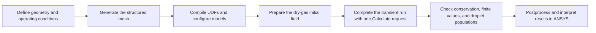
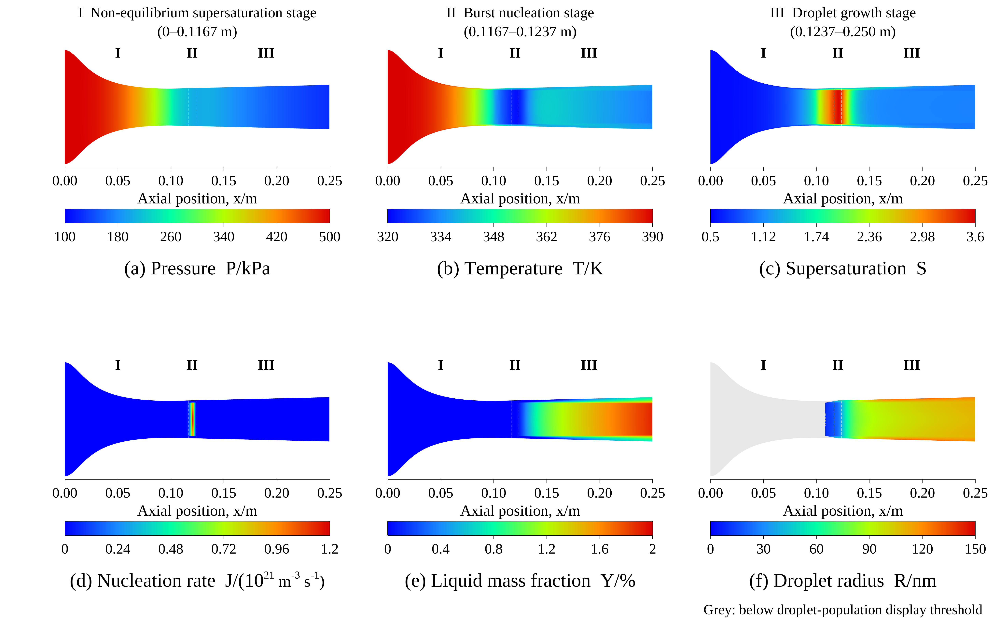

# CO₂–H₂O nozzle condensation: a Fluent case covering the full workflow

[中文](README.md) · [Fluent manual setup](#fluent-manual-run) · [Open saved results](docs/tutorial.md) · [Example results](#example-results) · [Results and limitations](docs/validation.md) · [License scope](LICENSES.md)

This case simulates the non-equilibrium condensation of H₂O in a CO₂–H₂O gas mixture flowing through a supersonic nozzle. It covers geometry and UDF development, preparation of the condensation calculation, a transient calculation started with one Calculate request, numerical checks, and ANSYS EnSight visualization of six fields. The package includes source code, mesh, final Case/Data files, cell data, per-step monitoring, and manual instructions.

**Recorded run: Windows / Fluent 2026 R1 Student, 30,000 cells, 100,000 steps, dt=10⁻⁷ s, and a final physical time of 0.01 s.** The production calculation completed through one Calculate request in approximately 15 h 05 min. This is a learning and workflow-verification case. Experimental validation, mesh independence, and time-step independence have not been established.

**Release status: initial public GitHub edition (2026-09-16).** This package provides manual instructions, with no automatic Fluent preparation program. The `native/` directory contains the final results and four UDF source files together. The Case retains the full model and UDF bindings; if `libfuel` is missing, manually Build/Load it in Fluent and then reread the files. **The reading attempt recorded on 2026-09-16 was blocked by Windows application control during Fluent startup, before the public Case was read; no security policy was changed.** Earlier successful reading of the original private files does not validate this public copy. Windows Fluent 2024 R2 and restoration across versions remain untested.

This README provides the full English counterpart of the Chinese README, including all 12 manual setup sections. The linked supporting documents in `docs/`, along with the citation and license-scope notes, are primarily in Chinese.

## Case overview



|Item|Case setting|
|---|---|
|Geometry|2D axisymmetric nozzle, 250 mm long; convergent/divergent lengths of 100/150 mm|
|Inlet/throat/exit diameters|39.9 / 12.9 / 15.5 mm|
|Boundary conditions|Inlet absolute total pressure 500 kPa and total temperature 390 K; outlet absolute static pressure 100 kPa; Operating Pressure=0 Pa|
|Composition|CO₂/H₂O mole fractions of 0.8/0.2, respectively|
|Physical models|Ideal-gas mixture, energy and species transport, SST k–ω, and two UDS equations for liquid moments|
|Production algorithm|Pressure-based PISO, second-order spatial and temporal discretization; at most 250 inner iterations per time step|

See [model definitions](docs/model.md) for the geometry, initial field, and modeling choices. These dimensions define this case; they do not represent a certified industrial device.

## Checks that do not require ANSYS

The following commands require only Python 3.10 or later and its standard library. They do not install dependencies or connect to a solver:

```powershell
python tools/verify_case.py
python tools/analyze_results.py
python tools/mesh/build_paper_mesh.py --output-dir C:/CFD_Learning/new_mesh
```

For the last command, use a new or empty output directory and change the example path as needed. The generator refuses to overwrite files with the same output names. The recorded offline mesh reconstruction is byte-identical to the mesh used in the original run.

With a configured C compiler, you can also run the [independent core tests](docs/core_tests.md). Neither these tests nor the CSV checks establish physical validity.

The path cleanup and dataset-by-dataset comparison of the paired Case/Data against the originals passed; see the [native-file audit](verification/native_files_check.json). The optional `python tools/verify_native.py` requires h5py/NumPy and checks 158 HDF datasets against that audit. It does not launch Fluent.

## Open the saved results in Fluent

Using your own ANSYS installation and an applicable license, follow the [reading instructions](docs/tutorial.md#2-在-fluent-读取已有结果) to open `native/final-100000.cas.h5` and the matching `.dat.h5`. The sources in the same directory support local UDF compilation. The Case has no saved source list for automatic compilation, so placing the files together does not guarantee automatic rebuilding. No precompiled DLL is supplied, and files are not guaranteed to open in every Fluent version. Once reading succeeds, inspect the saved fields and settings without initializing or clicking Calculate.

## Run a new Fluent simulation

<a id="fluent-manual-run"></a>

The following sections describe the manual procedure starting from the mesh. **To inspect the final results in `native/`, use the reading instructions above; do not perform the initialization or calculation steps below.** The final Data is already at 0.01 s. Calculating from that state advances the existing solution.

The values below come from the original configuration, preparation records, and saved Case, rather than being inferred from contour images. Fluent's English menu names are used; menu locations may differ between 2024 R2 and 2026 R1. **The instructions identify settings explicitly specified for this case and selected inherited settings that affect reproduction. If a value already matches, there is no need to change it again. Defaults can differ between releases, and unspecified options should not be adjusted arbitrarily.** Reviewing the documents and saved files does not establish that the complete manual workflow has been tested. The public copy has not yet passed an actual Fluent reading test, and 2024 R2 has not been tested.

The sequence is: import mesh → configure models and materials → allocate UDS/UDM → compile and bind UDFs → set boundaries → prepare the dry-gas initial field → configure the production transient calculation → configure monitoring and saving → start one production Calculate request. The GUI workflow does not require Python, PyFluent, or the removed preparation program.

### 1. Create a working directory, launch Fluent, and read the mesh

1. Create a separate, writable directory, preferably using ASCII characters, such as `C:/CFD_Learning/run_001/`. Do not overwrite the supplied reference results.
2. Copy `mesh/paper_nozzle_30000.msh` and the three `.c` files and one `.h` file from `udf/` into that directory. Create three subdirectories: `preparation/`, `checkpoints/`, and `final_exports/`. Also copy `native/export_final.jou` into the working directory for the native end-of-calculation export described later.
3. In Fluent Launcher, select **Solution, 2D, Double Precision, and CPU**, and set Working Directory to the directory above. The original run used **4 Solver Processes**; using the same configuration helps comparisons.
4. Select **File → Read → Mesh…** and read `paper_nozzle_30000.msh`. Do not read the final `.dat.h5` at this stage.
5. Run **Mesh → Check** and confirm that there are no errors such as negative volumes and that the cell count is **30000**. The mesh is already in **m**; do not apply an additional scale factor of 0.001. The axial extent should be `0–0.25 m`, the maximum radius `0.01995 m`, and the throat at `x=0.1 m` with radius `0.00645 m`.
6. Check the zones: fluid cell zone `fluid-domain`; boundaries `inlet`, `outlet`, `wall`, and `axis`. The `interior-fluid` and `throat-partition` zones are internal faces and must remain Interior.

### 2. General and Models

Configure the following items under **Setup**. Start in steady mode to prepare the dry-gas initial field; switch to transient in section 8.

|Location|Item|Setting|
|---|---|---|
|General → Solver|Type|**Pressure-Based**|
|General → Solver|Time|**Steady** during preparation; **Transient** for production|
|General → 2D Space|Spatial formulation|**Axisymmetric**, not Planar or an axisymmetric swirl model|
|Operating Conditions|Operating Pressure|**0 Pa**|
|Operating Conditions|Gravity|Off; verify this setting|
|Models → Energy|Energy Equation|**On**|
|Models → Viscous|Model|**k-omega → SST**|
|Models → Viscous|Wall Omega Treatment|**Correlation**; check where this option is available|
|Models → Species|Model|**Species Transport**|
|Models → Species|Mixture Material|`mixture-template`, edited in the next section|
|Models → Species|Reactions|Volumetric and wall reactions disabled; verify these settings|

This model represents the droplet population through two UDS equations and UDFs. Do not additionally enable VOF, Eulerian, DPM, or Wet Steam; those additions would change the original model. A density-based setting was used temporarily during the original setup, but both dry-gas pre-iterations and the production run used the pressure-based solver. Intermediate settings are not the final algorithm.

### 3. Materials: mixture, species, and properties

Open **Materials → Mixture → mixture-template → Create/Edit**. Under **Mixture Species → Edit**, retain only `h2o` and `co2`, with **h2o first and co2 last**. If needed, add water vapor and carbon dioxide from the Fluent Database, then return to the mixture editor. Do not select liquid water. The UDF reads H₂O as `species-0`, so the species order must not be reversed.

|Mixture property|Selection|
|---|---|
|Density|**ideal-gas**|
|Cp (Specific Heat)|**mixing-law**|
|Viscosity|**ideal-gas-mixing-law**|
|Thermal Conductivity|**ideal-gas-mixing-law**|
|UDS Diffusivity|After loading the UDF, set **user-defined → co2h2o_uds_diffusivity::libfuel** in section 5|

Next, edit the properties of the two individual species. Set the mixture transport mixing laws before editing species viscosity and conductivity so that the corresponding property entries are active.

|Species property|h2o|co2|
|---|---:|---:|
|Molecular Weight, kg/kmol|**18.01528**|**44.00950**|
|Cp, J/(kg·K)|**constant = 1864**|**piecewise-polynomial**, as below|
|Viscosity, Pa·s|**constant = 1.34e-5**|**constant = 1.37e-5**|
|Thermal Conductivity, W/(m·K)|**constant = 0.0261**|**constant = 0.0145**|

For CO₂ specific heat, use temperature as the independent variable, with **2 temperature intervals** and **5 coefficients per interval**. Enter the coefficients for `Cp=a0+a1×T+a2×T²+a3×T³+a4×T⁴`, with T in K:

|Temperature interval/K|a0|a1|a2|a3|a4|
|---|---:|---:|---:|---:|---:|
|300–1000|429.92889|1.8744735|-0.001966485|1.2972514e-6|-3.9999562e-10|
|1000–5000|841.37645|0.59323928|-0.00024151675|4.5227279e-8|-3.1531301e-12|

After each edit, click **Change/Create** or the corresponding Apply button in your version. Finally, select `mixture-template` under **Cell Zone Conditions → fluid-domain → Edit → Material Name**.

Although the sources contain `co2h2o_h2o_cp` and `co2h2o_co2_cp`, neither specific-heat UDF was bound in the original calculation. In particular, do not replace the CO₂ piecewise polynomial above with the UDF returning the constant 846. Retain other material properties that were not explicitly changed and check database differences when changing versions. The validity of properties at low temperatures remains a modeling question requiring further evaluation.

The following inherited settings were checked against the **final Case**; the original preparation script did not explicitly change them. Leave matching values in place and check them when switching releases. Gas-species diffusion and liquid UDS diffusion are separate settings.

|Location/meaning|Saved final Case value to check|
|---|---|
|Mixture → Mass Diffusivity|**constant-dilute-appx, 2.88e-5 m²/s**|
|Species → Turbulent Schmidt Number|**0.7**|
|Species → Thermal Diffusion / Full Multicomponent Diffusion|Both **Off**|
|Gas Species → Inlet Diffusion|**Off**|
|Species → Diffusion Energy Source|**On**, saved key `energy/species-diffusion?=#t`|
|Energy → Viscous Heating|**Off**, saved key `viscous-energy-dissipation?=#f`|
|Material enthalpy reference temperature|**298.15 K**|

For settings not exposed directly in the current panel, consult the original Case and the [settings review record](verification/readme_settings_review.json). Do not change other models merely to find a matching internal key. These Boolean values alone do not explain the complete energy equation.

### 4. Allocate 2 UDS and 26 UDM, then add and compile the UDFs

**Allocate storage before loading the library.** The loading function registers field names; loading too early can leave custom field names incomplete.

1. Open **User-Defined → Scalars…**, often under **Parameters & Customization → User Defined Scalars** in newer interfaces. Set Number of User-Defined Scalars to **2**.
2. For both UDS-0 and UDS-1, select **Solution Zones = all fluid zones, Flux Function = mass flow rate, and Unsteady Function = default**. Confirm that both equations exist.
3. Open **User-Defined → Memory…**, often under **Parameters & Customization → User Defined Memory**. Set the ordinary User-Defined Memory Locations to **26** and leave Node Memory at **0**. These are not 26 UDS or 26 node-memory locations.
4. Open **User-Defined → Functions → Compiled…**, or **Parameters & Customization → User Defined Functions → Compiled** in the newer layout.
5. Set Library Name to **`libfuel`**. Under Source Files, click **Add** and select `co2_h2o_condensation.c`, `condensation_core.c`, and `quasi1d_initialization.c`. Under Header Files, add **`condensation_core.h`**. These four files belong to this case; do not manually copy ANSYS's `udf.h`.
6. On Windows, enable **Use Built-In Compiler** and click **Build**. After the Console confirms successful compilation, click **Load**. Do not proceed to binding functions after a failed build.
7. Confirm that the functions listed in section 5 appear. Parallel runs require matching host/node libraries built by the current installation; do not use DLLs from another computer or Fluent release.

UDS **Inlet Diffusion** is **On** in the final Case (`uds/inlet-diffusion?=#t`). This retained setting differs from gas Species Inlet Diffusion=Off. Do not disable both merely because the option names are similar.

The UDS definitions and names registered when the library loads are:

|UDS|Meaning|Expected name|
|---|---|---|
|0|Liquid loading L, kg liquid water/kg gas|`liquid-loading-kg-liquid-per-kg-gas`|
|1|Droplet number N (#/kg gas) divided by 10¹⁵|`droplet-number-per-kg-gas-div-1e15`|

UDM stores source terms and diagnostic values. Do not manually enter initial values for each UDM or solve additional equations for them. The 26 fields are defined in the [field dictionary](docs/field_dictionary.csv). For example, UDM0 is supersaturation, UDM3 is the applied nucleation rate, UDM5 is radius in m, and UDM18 is the liquid mass fraction β of the wet mixture. β is not UDS-0.

Alternatively, use the following native commands in the Fluent Console to compile and load the library. These are not operating-system commands and do not require a preparation program. The two empty strings terminate the source-file and header-file lists, respectively. All four source files must be in the working directory:

```text
/define/user-defined/use-built-in-compiler? yes
/define/user-defined/compiled-functions compile "libfuel" yes "co2_h2o_condensation.c" "condensation_core.c" "quasi1d_initialization.c" "" "condensation_core.h" ""
/define/user-defined/compiled-functions load "libfuel"
```

For compilation, see the [ANSYS GUI instructions](https://ansyshelp.ansys.com/public/Views/Secured/corp/v261/en/flu_udf/flu_udf_sec_compile_gui.html) and [TUI instructions](https://ansyshelp.ansys.com/public/Views/Secured/corp/v261/en/flu_udf/flu_udf_sec_compile_tui.html). Local rebuilding and rereading of the public package still require runtime verification. Automatic rebuilding does not replace checking that Build/Load succeeded.

### 5. Bind the UDFs to the correct locations

**Successful compilation makes the functions available; the source, diffusivity, and global function bindings below are also required.**

Open **Cell Zone Conditions → fluid-domain → Edit** and enable **Source Terms**. Open **Edit** for each equation below, set Number of Sources to **1**, and select the corresponding UDF. Signs and units are handled in the C code. Do not add an extra multiplier or manually insert latent heat.

|Equation|Single source function|
|---|---|
|Mass|`co2h2o_mass_source::libfuel`|
|X / Axial Momentum|`co2h2o_xmom_source::libfuel`|
|Y / Radial Momentum|`co2h2o_ymom_source::libfuel`|
|Energy|`co2h2o_energy_source::libfuel`|
|h2o / Species-0|`co2h2o_h2o_source::libfuel`|
|User Scalar 0|`co2h2o_liquid_source::libfuel`|
|User Scalar 1|`co2h2o_number_source::libfuel`|

CO₂ is the last species and has no separate phase-change source. Each of the seven sources should appear exactly once.

Return to **Materials → mixture-template**, change the global **UDS Diffusivity** option to **user-defined**, select **`co2h2o_uds_diffusivity::libfuel`**, and apply. Both UDS equations use the coefficient `μt/0.9 + 1e-12`, in kg/(m·s). Assigning the function only in an inactive per-UDS entry may leave the global default in place.

Open **User-Defined → Functions → Function Hooks…** and add each function to the corresponding Selected Functions list:

|Function Hooks location|Function|Purpose|
|---|---|---|
|Initialization|`co2h2o_init::libfuel`|Clear UDS/UDM during initialization|
|Adjust|`co2h2o_adjust::libfuel`|Compute source and diagnostic caches during the solver's adjustment stage|
|Execute At End|`co2h2o_refresh_at_end::libfuel`|Refresh diagnostics at the end of each transient time step|

`co2h2o_on_loading` is called automatically when the library loads; do not place it in these lists. The two On-Demand functions are available under **User-Defined → Functions → Execute On Demand…** and are used as follows:

- **`co2h2o_quasi1d_initial_guess::libfuel`**: execute only when initializing a new case in section 7. It changes the flow field and clears UDS/UDM.
- **`co2h2o_refresh_diagnostics::libfuel`**: execute when preparing the production run in section 8. It recalculates and writes UDM, rather than merely refreshing the display. Do not execute it when inspecting the saved final state.

Dry-gas preparation in section 7 temporarily disables sources and some hooks. Restore all production bindings in section 8. The **UDF Execute At End hook** here is distinct from the file-export command executed after the entire Calculate request returns in section 11.

### 6. Boundary Conditions: configure each boundary

First set Operating Pressure to **0 Pa**, so the pressure values below also equal absolute pressures. The inlet specifies total pressure/temperature, while the outlet specifies static pressure.

Open **Boundary Conditions → inlet → Edit**. The boundary type is **pressure-inlet**:

|Tab/item|Value|
|---|---|
|Momentum → Gauge Total Pressure|**500000 Pa**|
|Momentum → Supersonic/Initial Gauge Pressure|**498500 Pa**|
|Turbulence → Specification Method|**Intensity and Hydraulic Diameter**|
|Turbulent Intensity (%)|**1**, meaning **1%**|
|Hydraulic Diameter|**0.0399 m**|
|Thermal → Total Temperature|**390 K**|
|Species → Specify Species in Mole Fractions|**Off**; use mass fractions|
|Species → h2o|**0.09283677142689885**; co2 is the remainder|
|UDS → UDS-0 and UDS-1|Both **Specified Value = 0**|

Open **outlet → Edit**. The boundary type is **pressure-outlet**:

|Tab/item|Value|
|---|---|
|Momentum → Gauge Pressure|**100000 Pa**|
|Backflow Turbulence → Specification Method|**Intensity and Hydraulic Diameter**|
|Backflow Turbulent Intensity (%)|**1**, meaning **1%**|
|Backflow Hydraulic Diameter|**0.0155 m**|
|Thermal → Backflow Total Temperature|**390 K**|
|Species → Specify Species in Mole Fractions|**Off**|
|Backflow h2o Mass Fraction|**0.09283677142689885**|
|UDS → UDS-0 and UDS-1|Both **Specified Flux = 0**|

Open **wall → Edit** and check **No Slip** and **Thermal → Heat Flux = 0 W/m²** (adiabatic). Both UDS use **Specified Flux = 0**. Keep `axis` as type **axis** and both internal-face zones as **interior**. These common defaults need no changes if they already match.

Also retain the boundary settings checked in the original Case: inlet and outlet-backflow directions are **Normal to Boundary**, with the reference frame **Absolute**; outlet Backflow Pressure Specification is **Total Pressure**; Prevent Reverse Flow is off at both boundaries. The wall is stationary, Roughness Height=0, and its H₂O condition is **Specified Flux (Mass)=0**. These checks add neither a phase-change model nor an extra inlet velocity or backflow-pressure value.

Two input conversions are particularly easy to confuse:

- An H₂O mole fraction of 0.2 corresponds to the mass fraction `0.2×18.01528/(0.2×18.01528+0.8×44.00950)=0.09283677142689885`. Do not enter 0.2 in a mass-fraction field.
- The original API/Case turbulence intensity is stored as the fraction **0.01**, so enter **1 in the GUI (%) field**. The official ANSYS example maps 10% to the API value 0.1, supporting this conversion. The case does not use a GUI intensity of 0.01%. See the [official fraction/percentage example](https://fluent.docs.pyansys.com/version/stable/examples/00-fluent/species_transport.html).

### 7. Standard Initialization and two-stage dry-gas preparation

Perform these steps only for a new simulation. The dry-gas preparation still includes water vapor; phase-change sources are temporarily disabled. The two steady iteration stages prepare the initial field. The production condensation calculation starts with one request in section 12.

1. Under **Cell Zone Conditions → fluid-domain**, temporarily disable **Source Terms**, retaining the selected functions.
2. Under **Function Hooks**, temporarily remove the selected **Adjust** and **Execute At End** functions. Retain **Initialization → co2h2o_init**.
3. Under **Solution → Controls → Equations…**, temporarily disable solving **UDS-0 and UDS-1**. Keep the energy, gas flow, turbulence, and species equations enabled.
4. Confirm **General = Pressure-Based / Steady**. Under **Solution → Methods → Pressure-Velocity Coupling**, select **SIMPLE**.
5. Under **Solution → Monitors → Residuals → Edit**, set **Absolute Criteria** to **1e-6** for Energy, h2o, UDS-0, and UDS-1, and **1e-4** for Continuity, Axial/Radial Velocity, k, and omega. Check that convergence checking is enabled for the required residual equations. These are iteration stopping criteria only.
6. Open **Solution Initialization**, select **Standard Initialization**, and enter the Initial Values below. If you first use Compute From, check that it has not replaced these explicit values. Then click **Initialize** once.

|Initial value|Value|
|---|---:|
|Gauge Pressure|498500 Pa|
|Temperature|390 K|
|Axial / X Velocity|20 m/s|
|Radial / Y Velocity|0 m/s|
|h2o Mass Fraction|0.09283677142689885|
|UDS-0 and UDS-1|Both 0|

7. Open **Execute On Demand** and execute **`co2h2o_quasi1d_initial_guess::libfuel`** once. This function constructs a variable-specific-heat quasi-one-dimensional initial guess for this nozzle's coordinates. It overwrites pressure, temperature, density, velocity, available enthalpy storage, species, and k/omega fields, and clears UDS/UDM. Its turbulence initial guess is `k=1.5×0.01²×speed²`, `omega=√k/(0.09^0.25×0.07×2R)`; the uniform k/omega values from Standard Initialization are not the final initial field. Confirm that the Console reports successful assignment, rather than incompatible geometry. This function does not reset transient history, so use it only at this fresh steady initialization stage.
8. Under **Solution Methods**, select **Standard** for Pressure and **First Order Upwind** for Density, Momentum, Turbulent Kinetic Energy, Specific Dissipation Rate, Energy/Temperature, and h2o. Under **Solution Controls**, set the Under-Relaxation Factors for both Energy/Temperature and h2o to **0.9**.
9. Under **Run Calculation**, set Number of Iterations to **500** and start the steady pre-iterations. Allow Fluent to stop early if its convergence criteria are met.
10. Change Pressure to **Second Order** and the other convection discretizations listed in step 8 to **Second Order Upwind**. Request up to **1000** further steady pre-iterations.
11. Use **File → Write → Case & Data…** to save `preparation/dry_initial_field.cas.h5` and its matching Data. Physical time should still be **0 s**.

500+1000 are the requested iteration limits, not proof that exactly 1500 iterations occurred during the original preparation. Do not ignore solver problems or overwrite an already converged record merely to reach that count.

### 8. Restore the condensation model and configure the production transient run

Retain the dry-gas field just prepared. **Do not initialize again or rerun the quasi-one-dimensional initial guess.** Restore the following in order:

1. Set **Source Terms = On** for `fluid-domain` and check that all seven source functions still match their equations.
2. Re-enable **UDS-0 and UDS-1** under **Equations**.
3. Restore **Adjust → co2h2o_adjust** and **Execute At End → co2h2o_refresh_at_end** in Function Hooks. Retain the Initialization binding.
4. Change General → Time to **Transient**, keeping the solver **Pressure-Based**.
5. Set the production methods and controls as follows.

|Location|Item|Production setting|
|---|---|---|
|Solution Methods|Pressure-Velocity Coupling|**PISO**|
|Spatial Discretization|Pressure|**Second Order**|
|Spatial Discretization|Density, Momentum, k, omega, Energy/Temperature, h2o, UDS-0, UDS-1|**Second Order Upwind**|
|Solution Methods|Transient Formulation|**Second Order Implicit**|
|Solution Controls → Under-Relaxation Factors|Energy/Temperature|**0.3**|
|Same location|h2o / Species-0|**0.5**|
|Same location|UDS-0 and UDS-1|**0.3 each**|
|Residuals → Absolute Criteria|Energy, h2o, UDS-0, UDS-1|**1e-6 each**|
|Same location|Continuity, Axial/Radial Velocity, k, omega|**1e-4 each**|
|Run Calculation|Time Advancement / Step Method|**Fixed / User-Specified**|
|Run Calculation|Time Step Size|**1e-7 s**|
|Run Calculation|Number of Time Steps|**100000**, starting at 0 s|
|Run Calculation|Max Iterations/Time Step|**250**|

Other saved Run Calculation settings to check are Reporting Interval=1, Profile Update Interval=1, Predict Next=Off, Extrapolate Variables=Off, and Data Sampling for Time Statistics=Off. These values were read back from the original run; they are not all claimed to differ from defaults. Do not treat the CFL=5 used during the earlier density-based setup as the physical time step for the production PISO calculation.

Now execute **`co2h2o_refresh_diagnostics::libfuel`** once to populate diagnostic values for the current dry-gas field. It does not advance time. Query `(rpgetvar 'flow-time)` in the Console and confirm **0**. Do not start the production Calculate request until the report and output settings below are complete.

### 9. Report Definitions: create all 27 monitors

Create the following reports under **Solution → Report Definitions → New**. For surface reports, select the specified boundary; for all volume reports, select `fluid-domain`. Keep Average Over at **1** for each report; a moving average is not an instantaneous value. Select fields by their custom names; UDS/UDM indices are provided for cross-checking.

|Report name|Type|Location|Field|
|---|---|---|---|
|gas-inlet|Surface → Mass Flow Rate|inlet|Mass flow rate|
|gas-outlet|Surface → Mass Flow Rate|outlet|Mass flow rate|
|outlet-water|Surface → Mass-Weighted Average|outlet|h2o|
|outlet-co2|Surface → Mass-Weighted Average|outlet|co2|
|outlet-loading|Surface → Mass-Weighted Average|outlet|liquid-loading… (UDS0)|
|outlet-beta|Surface → Mass-Weighted Average|outlet|liquid-mass-fraction-beta (UDM18)|
|outlet-radius|Surface → Mass-Weighted Average|outlet|droplet-radius-m (UDM5)|
|outlet-temp|Surface → Mass-Weighted Average|outlet|temperature|
|wall-yplus-max|Surface → Facet Maximum|wall|y-plus|
|max-s|Volume → Maximum|fluid-domain|h2o-supersaturation (UDM0)|
|max-j|Volume → Maximum|fluid-domain|nucleation-applied-m3-s (UDM3)|
|max-j-raw|Volume → Maximum|fluid-domain|nucleation-raw-m3-s (UDM15)|
|max-radius|Volume → Maximum|fluid-domain|droplet-radius-m (UDM5)|
|max-beta|Volume → Maximum|fluid-domain|liquid-mass-fraction-beta (UDM18)|
|min-temp|Volume → Minimum|fluid-domain|temperature|
|max-temp|Volume → Maximum|fluid-domain|temperature|
|min-h2o|Volume → Minimum|fluid-domain|h2o|
|min-loading|Volume → Minimum|fluid-domain|UDS0|
|min-number|Volume → Minimum|fluid-domain|UDS1|
|limiter-volume-fraction|Volume → Volume Average|fluid-domain|source-limiter-flag (UDM13)|
|risk-volume-fraction|Volume → Volume Average|fluid-domain|model-risk-flag (UDM14)|
|phase-transfer|Volume → Volume Integral|fluid-domain|condensation-source-applied-kg-m3-s (UDM8)|
|positive-condensation|Volume → Volume Integral|fluid-domain|positive-condensation-kg-m3-s (UDM16)|
|evaporation|Volume → Volume Integral|fluid-domain|evaporation-kg-m3-s (UDM17)|
|liquid-inventory|Volume → Mass Integral|fluid-domain|UDS0|
|vapor-inventory|Volume → Mass Integral|fluid-domain|h2o|
|co2-inventory|Volume → Mass Integral|fluid-domain|co2|

Create `physics-history` under **Monitors → Report Files**:

- Select all **27** Report Definitions and set File Name to `physics-history.out` in the current working directory.
- Set **Active = On, Write Instantaneous Values = On, Frequency Of = Time Step, and Frequency = 1**. In 2026 R1, enabling instantaneous values locked the actual output interval to every time step. If the field is not editable, verify that the stored value is 1.
- Under Report Plots, create `outlet-liquid`, select only `outlet-beta`, set Active=On, and plot **every 10 Time Steps** in Window=1. Plot frequency is not file-writing frequency.

The original record includes time zero and steps 1–100000. At the end of preparation, evaluate/check that the reports are available and confirm whether the history includes the initial state. If your version does not automatically write the t=0 row, retain the initial reports separately and document the format difference; do not fabricate a row. Fluent mass flow rates have directional signs. Do not replace the original values with their absolute values.

### 10. Autosave Case/Data

Configure **Calculation Activities → Autosave**, or File → Auto Save:

|Item|Value|
|---|---|
|Save Data File Every|**500 Time Steps**|
|Save Associated Case Files|**Each Time**, saving a matching Case each time|
|File Name / Root Name|**`checkpoints/checkpoint`** under the current working directory|
|Append File Name With|**Time Step**|
|Retain Only the Most Recent Files|**Off**, retaining all files|

Use directories that exist in your own environment, not paths from the author's computer. Saving Case/Data can change the autosave root name. After writing and rereading the initial files, recheck the directory, frequency, paired Case saving, and retention policy.

### 11. Create six Contours and the end-of-calculation export

Create the following objects under **Results → Graphics → Contours → New**. Keep the names exactly as shown because the supplied journal calls them by name:

|Object name|Field|Native unit|Color-bar number format|
|---|---|---|---|
|fig2-a-pressure|absolute-pressure|Pa|`%0.2e`|
|fig2-b-temperature|temperature|K|`%0.1f`|
|fig2-c-supersaturation|h2o-supersaturation / UDM0|Dimensionless|`%0.2f`|
|fig2-d-nucleation|nucleation-applied-m3-s / UDM3|m⁻³·s⁻¹|`%0.2e`|
|fig2-e-liquid-fraction|liquid-mass-fraction-beta / UDM18|Dimensionless|`%0.4f`|
|fig2-f-droplet-radius|droplet-radius-m / UDM5|m|`%0.2e`|

Use the **entire 2D cell domain** for all six objects. Do not select only the face lines of `interior-fluid` or `throat-partition`. In the original native configuration, the Surfaces list is empty, representing the full 2D domain. Set **Filled=On, Node Values=On, Smooth=On, Contour Lines=Off, Auto Range=On, and Global Range=On**. Set Boundary Values=On and Draw Mesh=Off where those options are active. Use the original `field-velocity` color map with Size=100, Visible=On, and Log Scale=Off. If custom field names are missing, resolve UDF loading before executing the complete export.

In the view settings, select **Mirror Zones = axis** to display both halves of the nozzle. This changes only the display; it does not add computational cells or duplicate data. Turn off graphics Overlays and show the Color Map. Set picture output to **PNG, Color, Landscape, 2600×800**, disable Use Window Resolution, and retain **Invert Background=On**. For each image, the journal performs Display, Auto Scale, Zoom=2.2, and Save Picture. Node Values uses interpolation, so legend extrema need not exactly match cell-centered CSV extrema.

These are native full-field plots, not the later six-panel layout or its radius filtering. Convert radius from m to nm, convert liquid mass fraction to %, and apply the valid-droplet-population display filter separately as described in the [ANSYS postprocessing instructions](docs/postprocessing.md). Do not overwrite the original data.

Finally, create an entry under **Solution → Calculation Activities → Execute Commands**:

|Item|Setting|
|---|---|
|Name|`fuel-native-final-export`|
|Command|`/file/read-journal "C:/CFD_Learning/run_001/export_final.jou"`; replace with your actual path|
|Execution timing|**Execute At End**, when the current Calculate request returns|
|Python Command|**Off**; this is a native Fluent command|
|Enabled|Enable only after entering Command|

Use [export_final.jou](native/export_final.jou), copied in section 1, with your own run directory still selected as the working directory. It writes paired Case/Data, a cell-centered CSV for the full domain, and six PNG files, then restores the autosave root name to `./checkpoints/checkpoint`. It contains no initialization or solution commands and is not the removed Fluent preparation program. It cannot be used as an unconditional general-purpose export before the graphics objects above have been created.

The CSV uses **ASCII, Comma Delimited, Cell-Centered, and the full physical cell domain**. It contains 8 gas fields, 2 UDS, and 26 UDM. With the cell identifier and x/y coordinates, this gives 39 columns and 30000 data rows. Retain the distinction between node-interpolated contours and cell-centered exports. Export all original UDS, risk flags, and limiter fields; do not remove negative values or duplicate the lower half of the domain for display mirroring.

**Execute At End can also trigger after a manual interruption or a short test run.** A file named `final` does not prove that the planned run finished. `%t` in the journal uses the actual step number; exporting again at the same step may still prompt for overwrite confirmation. If only picture export fails, first inspect Case/Data and the CSV. That failure does not justify reinitializing the field.

### 12. Save the initial case, run the calculation, and reread results

Check the following in order before starting. All output settings should already be complete:

1. Current Flow Time=**0 s**; UDS=**2**, UDM=**26**; both UDS equations are enabled; the seven sources, diffusivity function, and three Function Hooks are correctly assigned.
2. **Pressure-Based / Transient / PISO**, with the correct spatial and temporal discretization; time step **1e-7 s**, **100000** steps, and at most **250** inner iterations per step. Restore production relaxation factors after dry-gas preparation.
3. The report file writes every step, autosave runs every 500 steps, and the six Contours and end-export paths are correct.
4. Use **File → Write → Case & Data** to save your initial `checkpoints/checkpoint.cas.h5` and matching Data. Reread these **initial** files and recheck time, UDF loading, models/methods, step settings, and autosave root name. Do not reinitialize after reading them.
5. Select **Run Calculation → Calculate** to start the full 100000-step production condensation calculation with one request. The two steady preparation stages have already been completed above.
6. After completion, query `(rpgetvar 'time-step)` and `(rpgetvar 'flow-time)` in the Console. They should return **100000** and approximately **0.01**, respectively. Also check residuals, monitoring history, and log errors. Multiple Fluent processes indicate a parallel session; their presence alone does not show that solving has started.
7. Retain the matching final `.cas.h5` and `.dat.h5`, the UDF sources used for this run, monitoring output, and logs. To inspect the results later, **Read Case** first and then **Read Data**. If the library is missing, compile/load it in the same working directory as described in section 4, then reread the files. When inspecting the final state, do not repeat initialization from section 7 or diagnostic refresh from section 8.

The original full run took approximately 15 h 05 min, but runtime depends on the machine, initial field, and software version. Completing the planned steps and meeting residual criteria does not establish mesh/time-step independence, strict conservation, or physical validity. See [validation scope](docs/validation.md) for known limitations and the [manual reference](docs/manual_setup.md) for additional field definitions and the provenance of settings.

<a id="example-results"></a>

## Example results



[Chinese full-size figure](figures/figure2_cn.png) · [English full-size figure](figures/figure2_en.png)

Images used courtesy of ANSYS, Inc.

Radius is quantitatively colored only where **L>10⁻¹² kg liquid water/kg gas and N>0**; the excluded region is gray. Here L=UDS0 and N=UDS1×10¹⁵, with N in #/kg gas. The valid region spans approximately 7.227–129.792 nm. The unfiltered field contains a roughly 780.768 μm diagnostic tail at extremely small liquid inventories. This is a display filter: it does not rewrite the original values or establish that the tail's influence during solving can be neglected. See the [postprocessing tutorial](docs/postprocessing.md) for the full procedure.

Regions I, II, and III in the figure are visualization intervals for this result, not universal physical phase boundaries. Region I represents expansion and the development of supersaturation; S is not greater than 1 everywhere within it. Nucleation is not zero everywhere outside region II either. The liquid mass fraction labeled Y in panel (e) is UDM18's β=max(L,0)/(1+max(L,0)), multiplied by 100 for display in %. It is neither UDS0 nor the gas-phase H₂O mass fraction.

## Directory layout

|Directory|Contents|
|---|---|
|`native/`|Final Case/Data and four colocated UDF source files; full model bindings are retained, requiring a locally compiled library|
|`udf/`|The four C/header files used in the recorded run, preserving the numerical logic|
|`mesh/`, `tools/mesh/`|Original mesh, wall coordinates, and tools for offline mesh reconstruction|
|`data/`|Final 30000-cell CSV and complete step 0–100000 monitoring history, compressed losslessly with gzip|
|`logs/`|Complete solver transcript with machine identifiers and personal paths redacted|
|`figures/`|Chinese and English ANSYS figures with an explanation of the gray display mask|
|`tests/`, `verification/`|Independent implementation tests, historical audits, and public-package check records|
|`docs/`, `provenance/`|Tutorials, model limitations, data definitions, provenance, and modification records|

## Reproducibility scope and open licenses

The package provides two paths: inspect the native saved results, or manually reconstruct a run from source and mesh. The public Case/Data are copies prepared for sharing; the original private archive remains separate. Consult the audit records for specific modifications and reading-test status. EnSight restoration backups, unpublished manuscripts, third-party PDFs, ANSYS binaries/headers, system fonts, and connection credentials are excluded. The CSV and monitoring history are retained, with traceable source hashes.

Project code is licensed under [MIT](LICENSE). Authored documentation and licensable data/figure contributions use [CC BY 4.0](LICENSES/CC-BY-4.0.txt); see [LICENSES.md](LICENSES.md) for the exact scope. These licenses do not grant rights to use ANSYS software or change third-party rights. The case's educational purpose and scientific-validation status are factual descriptions, not additional noncommercial copyright restrictions.

AI assisted code implementation, automation, checks, and documentation. The shared numerical fields come from Fluent solution and export, and the figures come from ANSYS postprocessing. Generated reference images were not used as quantitative calibration targets. See [data provenance](docs/data_card.md). For citation, see [CITATION.md](CITATION.md); for third-party sources and rights, see [THIRD_PARTY_NOTICES.md](THIRD_PARTY_NOTICES.md).

Public repository: [zanekung/co2-h2o-fluent-condensation](https://github.com/zanekung/co2-h2o-fluent-condensation). The initial publication date is 2026-09-16; cite the specific commit used. See [CHANGELOG.md](CHANGELOG.md) for changes. This case has no DOI, and no official ANSYS endorsement is claimed.

If you change the model or obtain new results, retain the inputs, software version, source-code hashes, and verification records. Similar-looking contours are not evidence that a model is correct.
