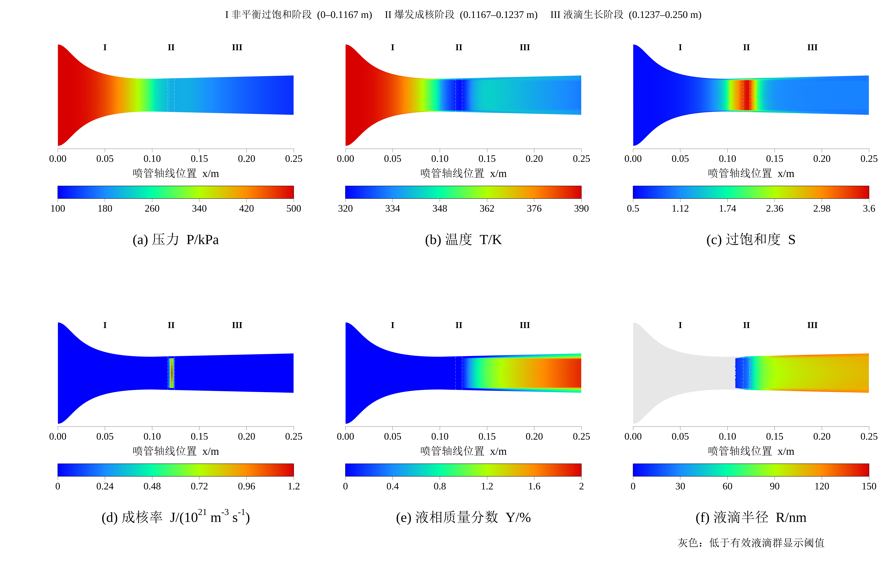

# CO₂–H₂O 喷管凝结：Fluent 全流程学习案例

[English](README.en.md) · [Fluent 手动设置](#fluent-manual-run) · [查看已有结果](docs/tutorial.md) · [示例结果](#example-results) · [结果与限制](docs/validation.md) · [许可证范围](LICENSES.md)

本案例模拟 CO₂–H₂O 混合气体在超音速喷管中流动时 H₂O 的非平衡凝结，展示从喷管几何和 UDF 源码出发，准备凝结计算、一次启动完整瞬态计算、检查数值结果，并用 ANSYS EnSight 绘制六个物理场的流程。它包含源代码、网格、最终 Case/Data、单元数据、逐步监测和手动操作说明。

**已记录运行：Windows / Fluent 2026 R1 Student，30000 个单元，100000 步，dt=10⁻⁷ s，总物理时间 0.01 s。** 正式计算通过一次 Calculate 完成，约耗时 15 小时 05 分。用途为学习和方法流程检验，尚无实验验证、网格独立性或时间步独立性结论。

**公开版本状态：GitHub 首次公开版（2026-09-16）。** 本版采用手动操作说明，不提供 Fluent 自动准备程序。`native/` 提供最终结果和同目录的四个 UDF 源文件，Case 保留完整模型及 UDF 挂接；缺少 `libfuel` 时须在 Fluent 内手动 Build/Load 后重新读取。**2026-09-16 的新副本读取测试被本机 Windows 应用控制阻止在 Fluent 启动阶段，尚未读到 Case；没有修改安全策略。** 原始私有文件此前曾读入成功，不等于这个公开副本已验证。Windows Fluent 2024 R2 与跨版本恢复未测试。

## 案例内容


|项目|本案例设置|
|---|---|
|几何|二维轴对称喷管，总长 250 mm；收缩/扩张段 100/150 mm|
|入口/喉部/出口直径|39.9 / 12.9 / 15.5 mm|
|边界|入口绝对总压 500 kPa、总温 390 K；出口绝对静压 100 kPa；Operating Pressure=0 Pa|
|组成|CO₂/H₂O 摩尔分数分别为 0.8/0.2|
|物理模型|理想混合气、能量与组分输运、SST k–ω、两个液相矩输运 UDS|
|正式算法|pressure-based PISO，二阶空间/时间；每步最多 250 次内迭代|

几何、初始场和物理模型的取舍见 [模型说明](docs/model.md)。主要尺寸是一套明确的案例输入，不宣称代表已认证工业设备。

## 不运行 ANSYS 也能检查的内容

只需 Python 3.10 或更新版本，以下步骤不安装依赖、不连接求解器：

```powershell
python tools/verify_case.py
python tools/analyze_results.py
python tools/mesh/build_paper_mesh.py --output-dir C:/CFD_Learning/new_mesh
```

最后一条使用新的或空的输出目录，并按需修改示例路径；生成器拒绝覆盖同名输出文件。已记录的离线重建网格与原运行网格逐字节一致。

若已有配置好的 C 编译器，还可执行 [独立核心测试](docs/core_tests.md)。这些测试和 CSV 检查不等于物理验证。

配套 Case/Data 的路径清理与原始数据逐集对比已通过，详见 [原生文件核查](verification/native_files_check.json)。可选的 `python tools/verify_native.py` 需要 h5py/NumPy，用于核对 158 个 HDF 数据集；它也不会启动 Fluent。

## 在 Fluent 查看已有结果

使用自己的 ANSYS 安装和适用许可，按 [读取步骤](docs/tutorial.md#2-在-fluent-读取已有结果) 打开 `native/final-100000.cas.h5` 与匹配的 `.dat.h5`。同目录源码用于本机 UDF 编译；Case 未保存自动编译源码清单，不能依赖同目录文件自动重建库。没有附带预编译 DLL，也不保证不同版本可无条件打开。读取成功后即可查看保存的场量和计算设置，无需初始化或点击 Calculate。

## 自行执行 Fluent 计算

<a id="fluent-manual-run"></a>

下面给出从网格开始的完整手动操作。**只查看 `native/` 中的最终结果时，使用上面的读取步骤，不执行本节初始化或计算。** 最终 Data 已到 0.01 s；在它上面再次计算会继续时间推进。

数值依据为原运行配置、准备过程及保存的 Case，而不是根据云图外观反推。菜单采用 Fluent 英文名称；2024 R2 与 2026 R1 的菜单位置可能不同。**本节列出原案例明确指定的设置，以及少量会影响复现的默认核对项；已有值相同时无需重复更改。不同版本默认值不一定相同，未列出的选项不应随意调整。** 文档和保存文件的核对不代表手动流程已完成端到端实测；公开副本尚未通过 Fluent 实际读取验证，2024 R2 也未实测。

操作分为：导入网格 → 模型与材料 → 分配 UDS/UDM → 编译和挂接 UDF → 边界 → 干气初场 → 正式瞬态参数 → 监控与保存 → 一次正式 Calculate。GUI 操作不需要 Python、PyFluent 或已移除的准备程序。

### 1. 建立工作目录、启动 Fluent、读入网格

1. 新建独立、可写、尽量只含英文字母和数字的目录，例如 `C:/CFD_Learning/run_001/`。不要在随包的参考结果上覆盖保存。
2. 将 `mesh/paper_nozzle_30000.msh` 和 `udf/` 中的三个 `.c`、一个 `.h` 文件复制到该目录。新建 `preparation/`、`checkpoints/`、`final_exports/` 三个子目录；将 `native/export_final.jou` 也复制到工作目录，后续用于原生结束导出。
3. Fluent Launcher 选择 **Solution、2D、Double Precision、CPU**，Working Directory 选择上述目录。原运行使用 **4 个 Solver Processes**；使用相同配置便于对照。
4. 选择 **File → Read → Mesh…**，读入 `paper_nozzle_30000.msh`。此时不用读最终 `.dat.h5`。
5. 执行 **Mesh → Check**，确认没有负体积等网格错误、单元数为 **30000**。网格已经使用 **m**，不要再缩放 0.001：轴向范围应为 `0–0.25 m`，最大半径 `0.01995 m`，喉部位于 `x=0.1 m`、半径 `0.00645 m`。
6. 核对区域：流体区 `fluid-domain`；入口 `inlet`、出口 `outlet`、壁面 `wall`、轴线 `axis`；`interior-fluid` 和 `throat-partition` 是内部面，保持 Interior。

### 2. General 和 Models

在左侧 **Setup** 下逐项设置。先选择定常，是为了准备干气初场；第 8 节再切换瞬态。

| 位置 | 项目 | 设置 |
|---|---|---|
| General → Solver | Type | **Pressure-Based** |
| General → Solver | Time | 准备时 **Steady**；正式计算改 **Transient** |
| General → 2D Space | 空间形式 | **Axisymmetric**，不是 Planar 或带旋流模型 |
| Operating Conditions | Operating Pressure | **0 Pa** |
| Operating Conditions | Gravity | 关闭；核对项 |
| Models → Energy | Energy Equation | **On** |
| Models → Viscous | Model | **k-omega → SST** |
| Models → Viscous | Wall Omega Treatment | **Correlation**；有此选项时核对 |
| Models → Species | Model | **Species Transport** |
| Models → Species | Mixture Material | `mixture-template`，下一节编辑 |
| Models → Species | Reactions | 不启用体积反应、壁面反应；核对项 |

本模型用两个 UDS 和 UDF 描述液滴群，不需要额外开启 VOF、Eulerian、DPM 或 Wet Steam；额外叠加这些模型会改变原计算。原设置过程一度使用密度基选项，但干气预迭代和正式运行都已切换压力基，不把中途设置当成最终算法。

### 3. Materials：混合物、组分与物性

打开 **Materials → Mixture → mixture-template → Create/Edit**，在 **Mixture Species → Edit** 中只保留 `h2o` 和 `co2`，顺序为 **h2o 第一、co2 最后**。若列表没有所需气体，通过 Fluent Database 添加对应水蒸气和二氧化碳材料，再回到混合物编辑；不要选液态水。UDF 按 `species-0` 读取 H₂O，组分顺序不能交换。

| 混合物属性 | 选择 |
|---|---|
| Density | **ideal-gas** |
| Cp (Specific Heat) | **mixing-law** |
| Viscosity | **ideal-gas-mixing-law** |
| Thermal Conductivity | **ideal-gas-mixing-law** |
| UDS Diffusivity | 第 5 节加载 UDF 后设为 **user-defined → co2h2o_uds_diffusivity::libfuel** |

然后编辑两个纯组分的属性。先设置混合物输运混合法则，再编辑纯组分黏度和导热系数，避免相应属性节点尚未激活。

| 纯组分属性 | h2o | co2 |
|---|---:|---:|
| Molecular Weight，kg/kmol | **18.01528** | **44.00950** |
| Cp，J/(kg·K) | **constant = 1864** | **piecewise-polynomial**，如下表 |
| Viscosity，Pa·s | **constant = 1.34e-5** | **constant = 1.37e-5** |
| Thermal Conductivity，W/(m·K) | **constant = 0.0261** | **constant = 0.0145** |

CO₂ 比热选择温度为自变量，建立 **2 个温度区间**、每段 **5 个系数**，按 `Cp=a0+a1×T+a2×T²+a3×T³+a4×T⁴` 输入，T 的单位是 K：

| 温度区间/K | a0 | a1 | a2 | a3 | a4 |
|---|---:|---:|---:|---:|---:|
| 300–1000 | 429.92889 | 1.8744735 | -0.001966485 | 1.2972514e-6 | -3.9999562e-10 |
| 1000–5000 | 841.37645 | 0.59323928 | -0.00024151675 | 4.5227279e-8 | -3.1531301e-12 |

每次编辑后点击 **Change/Create** 或该版本的应用按钮。最后在 **Cell Zone Conditions → fluid-domain → Edit → Material Name** 选择 `mixture-template`。

源码中虽然能看到 `co2h2o_h2o_cp`、`co2h2o_co2_cp`，原计算没有挂接这两个比热 UDF；尤其不能用返回 846 常数的 CO₂ 函数代替上述分段多项式。保持其余未主动修改的材料属性；跨版本需要核对数据库差异。低温物性的适用性仍属于模型验证工作。

下面是从**最终 Case** 核对出的关键继承设置，原准备脚本没有主动修改它们。已有值一致时保持即可；换版本时须核对，尤其不要把气相扩散与液相 UDS 扩散混为一项。

| 位置/含义 | 最终 Case 保存值（核对项） |
|---|---|
| Mixture → Mass Diffusivity | **constant-dilute-appx，2.88e-5 m²/s** |
| Species → Turbulent Schmidt Number | **0.7** |
| Species → Thermal Diffusion / Full Multicomponent Diffusion | 均 **Off** |
| 气相 Species → Inlet Diffusion | **Off** |
| Species → Diffusion Energy Source | **On**，保存键 `energy/species-diffusion?=#t` |
| Energy → Viscous Heating | **Off**，保存键 `viscous-energy-dissipation?=#f` |
| 材料焓参考温度 | **298.15 K** |

对未在当前面板直接显示的核对项，可对照原 Case 和 [设置核对证据](verification/readme_settings_review.json)，不要为找到同名内部键而改动其他模型。上述布尔量不能单独代替对完整能量方程的物理解释。

### 4. 分配 2 个 UDS、26 个 UDM，再添加和编译 UDF

**先分配存储，再加载库。** 加载时函数会登记字段名称；过早加载可能导致自定义字段名称不完整。

1. 打开 **User-Defined → Scalars…**（新版通常位于 **Parameters & Customization → User Defined Scalars**），Number of User-Defined Scalars 设为 **2**。
2. 对 UDS-0 和 UDS-1 均选择 **Solution Zones = all fluid zones、Flux Function = mass flow rate、Unsteady Function = default**。确认两条方程存在。
3. 打开 **User-Defined → Memory…**，普通 User-Defined Memory Locations 设为 **26**；Node Memory 保持 **0**。不是 26 个 UDS，也不是 26 个节点内存。
4. 打开 **User-Defined → Functions → Compiled…**，或新版 **Parameters & Customization → User Defined Functions → Compiled**。
5. Library Name 填 **`libfuel`**。Source Files 点 **Add**，添加 `co2_h2o_condensation.c`、`condensation_core.c`、`quasi1d_initialization.c`；Header Files 添加 **`condensation_core.h`**。四个文件来自本案例，不需手动复制 ANSYS 的 `udf.h`。
6. Windows 下启用 **Use Built-In Compiler**，点击 **Build**。Console 确认编译成功后，再点击 **Load**；不要在编译失败后继续挂接。
7. 检查函数列表中出现第 5 节各函数。并行计算需要当前安装生成匹配的 host/node 库；不使用别人电脑或其他 Fluent 版本的 DLL。

UDS 的 **Inlet Diffusion** 在最终 Case 中为 **On**（`uds/inlet-diffusion?=#t`），这是继承后保留的核对项，与气相 Species 的 Inlet Diffusion=Off 不同；不要为了统一名称而把二者都关闭。

UDS 的物理含义如下，名称会由加载函数自动登记：

| UDS | 含义 | 应出现的名称 |
|---|---|---|
| 0 | 液水负载 L，kg 液水/kg 气体 | `liquid-loading-kg-liquid-per-kg-gas` |
| 1 | 液滴数 N（#/kg 气体）除以 10¹⁵ | `droplet-number-per-kg-gas-div-1e15` |

UDM 是源项和诊断缓存，不用逐个手工输入初值或额外求解方程。26 个字段的定义见 [字段表](docs/field_dictionary.csv)。例如 UDM0 是过饱和度、UDM3 是实际施加成核率、UDM5 是半径（m）、UDM18 是湿混合物液相质量分数 β；β 不等于 UDS-0。

也可在 Fluent Console 使用以下原生命令完成编译与加载；它们不是系统命令，不需要准备程序。末尾空字符串分别结束源文件和头文件列表，工作目录须包含四个源码文件：

```text
/define/user-defined/use-built-in-compiler? yes
/define/user-defined/compiled-functions compile "libfuel" yes "co2_h2o_condensation.c" "condensation_core.c" "quasi1d_initialization.c" "" "condensation_core.h" ""
/define/user-defined/compiled-functions load "libfuel"
```

编译方法依据 [ANSYS GUI 编译说明](https://ansyshelp.ansys.com/public/Views/Secured/corp/v261/en/flu_udf/flu_udf_sec_compile_gui.html)和 [TUI 编译说明](https://ansyshelp.ansys.com/public/Views/Secured/corp/v261/en/flu_udf/flu_udf_sec_compile_tui.html)。当前公开包的本机重编与重读仍需验证；自动重编不能替代对 Build/Load 是否成功的检查。

### 5. 将 UDF 挂到正确位置

**编译成功只代表函数可用，还必须完成下面的源项、扩散和全局函数挂接。**

打开 **Cell Zone Conditions → fluid-domain → Edit**，启用 **Source Terms**。对以下每个方程打开 **Edit**，Number of Sources 设为 **1**，来源选择对应 UDF。源项正负号和单位已在 C 代码中处理，不再额外乘系数或手填潜热。

| 方程 | 唯一源项函数 |
|---|---|
| Mass | `co2h2o_mass_source::libfuel` |
| X / Axial Momentum | `co2h2o_xmom_source::libfuel` |
| Y / Radial Momentum | `co2h2o_ymom_source::libfuel` |
| Energy | `co2h2o_energy_source::libfuel` |
| h2o / Species-0 | `co2h2o_h2o_source::libfuel` |
| User Scalar 0 | `co2h2o_liquid_source::libfuel` |
| User Scalar 1 | `co2h2o_number_source::libfuel` |

CO₂ 是最后组分，没有单独的相变源项。七项应各出现一次，避免重复添加。

回到 **Materials → mixture-template**，将 **UDS Diffusivity** 的全局选项改为 **user-defined**，选择 **`co2h2o_uds_diffusivity::libfuel`** 并应用。两条 UDS 使用该函数给出的 `μt/0.9 + 1e-12` 输运系数，单位为 kg/(m·s)；只在不活动的单 UDS 子项填函数可能仍保留全局默认值。

再打开 **User-Defined → Functions → Function Hooks…**，将下列函数加入相应的 Selected Functions 列表：

| Function Hooks 位置 | 函数 | 执行作用 |
|---|---|---|
| Initialization | `co2h2o_init::libfuel` | 初始化时清零 UDS/UDM |
| Adjust | `co2h2o_adjust::libfuel` | 求解调整阶段计算源项与诊断缓存 |
| Execute At End | `co2h2o_refresh_at_end::libfuel` | 瞬态时间步末刷新诊断 |

`co2h2o_on_loading` 由加载库自动调用，不手工放进上述列表。两个 On-Demand 函数放在 **User-Defined → Functions → Execute On Demand…** 中按步骤执行：

- **`co2h2o_quasi1d_initial_guess::libfuel`**：仅第 7 节新算例初始化时执行，会修改流场并清零 UDS/UDM。
- **`co2h2o_refresh_diagnostics::libfuel`**：第 8 节准备正式计算时执行，重算并写入 UDM；它不是单纯刷新显示，查看已保存终态时不执行。

第 7 节干气准备会暂时关闭源项和部分 hooks；第 8 节必须恢复本节全部正式挂接。这里的 **UDF Execute At End** 与第 11 节整次 Calculate 结束后的文件导出命令是两个不同功能。

### 6. Boundary Conditions：逐个边界填写

Operating Pressure 必须先设为 **0 Pa**，此时下表压力也是绝对压力。入口给的是总压/总温，出口给的是静压。

打开 **Boundary Conditions → inlet → Edit**，边界类型为 **pressure-inlet**：

| 页签/项目 | 填写值 |
|---|---|
| Momentum → Gauge Total Pressure | **500000 Pa** |
| Momentum → Supersonic/Initial Gauge Pressure | **498500 Pa** |
| Turbulence → Specification Method | **Intensity and Hydraulic Diameter** |
| Turbulent Intensity (%) | **1**，即 **1%** |
| Hydraulic Diameter | **0.0399 m** |
| Thermal → Total Temperature | **390 K** |
| Species → Specify Species in Mole Fractions | **关闭**，使用质量分数 |
| Species → h2o | **0.09283677142689885**；co2 为余量 |
| UDS → UDS-0、UDS-1 | 两者均 **Specified Value = 0** |

打开 **outlet → Edit**，边界类型为 **pressure-outlet**：

| 页签/项目 | 填写值 |
|---|---|
| Momentum → Gauge Pressure | **100000 Pa** |
| Backflow Turbulence → Specification Method | **Intensity and Hydraulic Diameter** |
| Backflow Turbulent Intensity (%) | **1**，即 **1%** |
| Backflow Hydraulic Diameter | **0.0155 m** |
| Thermal → Backflow Total Temperature | **390 K** |
| Species → Specify Species in Mole Fractions | **关闭** |
| Backflow h2o Mass Fraction | **0.09283677142689885** |
| UDS → UDS-0、UDS-1 | 两者均 **Specified Flux = 0** |

打开 **wall → Edit**，核对 **No Slip**、**Thermal → Heat Flux = 0 W/m²**（绝热）；两个 UDS 均为 **Specified Flux = 0**。`axis` 保持 **axis** 类型，两个内部面保持 **interior**。这些常见默认项在已有值相同时不需要修改。

另外保留原 Case 的边界核对项：入口及出口回流方向均为 **Normal to Boundary**，参考系为 **Absolute**；出口 Backflow Pressure Specification 为 **Total Pressure**；两边的 Prevent Reverse Flow 均关闭。壁面静止、Roughness Height=0，壁面 H₂O 条件为 **Specified Flux (Mass)=0**。这些项不是额外的相变模型，也不是新增的入口速度或回流压力数值。

两个容易混淆的输入换算：

- H₂O 摩尔分数 0.2 对应质量分数 `0.2×18.01528/(0.2×18.01528+0.8×44.00950)=0.09283677142689885`，不能在质量分数框内填 0.2。
- 原 API/Case 存储的湍流强度是比例 **0.01**，因此 GUI 的 **(%) 框填 1**。ANSYS 官方示例明确把 10% 对应到 API 值 0.1，可核对这一换算；本案例不是 GUI 填 0.01%。[官方比例与百分数示例](https://fluent.docs.pyansys.com/version/stable/examples/00-fluent/species_transport.html)

### 7. Standard Initialization 与两阶段干气准备

以下操作只对新建的复算工程执行。干气准备仍含水蒸气，只是暂时关闭凝结源项；两次定常预迭代属于初场准备，正式凝结在第 12 节一次启动。

1. **Cell Zone Conditions → fluid-domain**：暂时关闭 **Source Terms**，保留已选好的函数。
2. **Function Hooks**：暂时移除 **Adjust** 和 **Execute At End** 的已选函数，保留 **Initialization → co2h2o_init**。
3. **Solution → Controls → Equations…**：暂时取消 **UDS-0、UDS-1** 的求解。能量、气相流动、湍流和组分方程保持启用。
4. 确认 **General = Pressure-Based / Steady**；在 **Solution → Methods → Pressure-Velocity Coupling** 选择 **SIMPLE**。
5. **Solution → Monitors → Residuals → Edit**：将 Energy、h2o、UDS-0、UDS-1 的 **Absolute Criteria** 设为 **1e-6**，Continuity、Axial/Radial Velocity、k、omega 设为 **1e-4**。核对需要监测的残差方程已启用收敛检查；这只是迭代停止准则。
6. 打开 **Solution Initialization**，选择 **Standard Initialization**，在 Initial Values 中填下表。若先用了 Compute From，再确认它没有覆盖下面的明确输入；然后只点一次 **Initialize**。

| 初值 | 值 |
|---|---:|
| Gauge Pressure | 498500 Pa |
| Temperature | 390 K |
| Axial / X Velocity | 20 m/s |
| Radial / Y Velocity | 0 m/s |
| h2o Mass Fraction | 0.09283677142689885 |
| UDS-0、UDS-1 | 均 0 |

7. 打开 **Execute On Demand**，选择并执行一次 **`co2h2o_quasi1d_initial_guess::libfuel`**。该函数按本喷管坐标建立变比热准一维初猜，覆盖压力、温度、密度、速度、可用的焓存储、组分及 k/omega 初场，并清零 UDS/UDM。其湍流初猜为 `k=1.5×0.01²×speed²`、`omega=√k/(0.09^0.25×0.07×2R)`，不用另行把均匀 k/omega 初值当作最后的初场。Console 应确认初猜写入成功，而不是报告几何不兼容。它不会重置瞬态历史，因此只在这里的新定常初始化阶段使用。
8. **Solution Methods**：Pressure 选 **Standard**；Density、Momentum、Turbulent Kinetic Energy、Specific Dissipation Rate、Energy/Temperature、h2o 选 **First Order Upwind**。**Solution Controls**：Energy/Temperature 与 h2o 的 Under-Relaxation Factors 都设为 **0.9**。
9. **Run Calculation**：Number of Iterations 设为 **500**，开始定常预迭代；满足收敛条件时允许提前停止。
10. Pressure 改为 **Second Order**，第 8 步其他对流离散项改为 **Second Order Upwind**。再请求最多 **1000** 次定常预迭代。
11. 通过 **File → Write → Case & Data…** 保存为 `preparation/dry_initial_field.cas.h5` 及配套 Data。此时物理时间应仍为 **0 s**。

500+1000 是两次请求的上限，不代表原准备过程必定完成 1500 次迭代；不要为了凑次数忽略求解异常或覆盖已经收敛的保存记录。

### 8. 恢复凝结模型，设置正式瞬态计算

保留刚才的干气场，**不要再次 Initialize 或执行准一维初猜**。依次恢复：

1. `fluid-domain` 的 **Source Terms = On**，核对七个源项仍一一对应。
2. **Equations** 中重新启用 **UDS-0、UDS-1**。
3. Function Hooks 恢复 **Adjust → co2h2o_adjust**、**Execute At End → co2h2o_refresh_at_end**，Initialization 保持原挂接。
4. General 的 Time 改为 **Transient**；Solver 保持 **Pressure-Based**。
5. 按下表设置正式方法与控制量。

| 位置 | 项目 | 正式设置 |
|---|---|---|
| Solution Methods | Pressure-Velocity Coupling | **PISO** |
| Spatial Discretization | Pressure | **Second Order** |
| Spatial Discretization | Density、Momentum、k、omega、Energy/Temperature、h2o、UDS-0、UDS-1 | **Second Order Upwind** |
| Solution Methods | Transient Formulation | **Second Order Implicit** |
| Solution Controls → Under-Relaxation Factors | Energy/Temperature | **0.3** |
| 同上 | h2o / Species-0 | **0.5** |
| 同上 | UDS-0、UDS-1 | **各 0.3** |
| Residuals → Absolute Criteria | Energy、h2o、UDS-0、UDS-1 | **各 1e-6** |
| 同上 | Continuity、Axial/Radial Velocity、k、omega | **各 1e-4** |
| Run Calculation | Time Advancement / Step Method | **Fixed / User-Specified** |
| Run Calculation | Time Step Size | **1e-7 s** |
| Run Calculation | Number of Time Steps | **100000**，从 0 s 开始 |
| Run Calculation | Max Iterations/Time Step | **250** |

Run Calculation 的其他已保存核对值为：Reporting Interval=1、Profile Update Interval=1、Predict Next=Off、Extrapolate Variables=Off、Data Sampling for Time Statistics=Off。这些是原运行的读回值，不宣称都是非默认项。不要把密度基配置阶段出现过的 CFL=5 当成 PISO 正式求解所需的物理时间步。

现在执行一次 **`co2h2o_refresh_diagnostics::libfuel`**，建立当前干气场对应的诊断值；它不会推进时间。Console 查询 `(rpgetvar 'flow-time)` 应为 **0**。后面的报告和输出设置完成前，暂不点击正式 Calculate。

### 9. Report Definitions：建立全部 27 项监测

在 **Solution → Report Definitions → New** 中创建以下报告。表面报告选择指定 boundary，体积报告全部选择 `fluid-domain`；每项 Average Over 保持 **1**，不要把滑动平均当瞬时值。字段可按自定义名称选择，括号内给出 UDS/UDM 索引帮助核对。

| 报告名 | 类型 | 位置 | 字段 |
|---|---|---|---|
| gas-inlet | Surface → Mass Flow Rate | inlet | 质量流量 |
| gas-outlet | Surface → Mass Flow Rate | outlet | 质量流量 |
| outlet-water | Surface → Mass-Weighted Average | outlet | h2o |
| outlet-co2 | Surface → Mass-Weighted Average | outlet | co2 |
| outlet-loading | Surface → Mass-Weighted Average | outlet | liquid-loading…（UDS0） |
| outlet-beta | Surface → Mass-Weighted Average | outlet | liquid-mass-fraction-beta（UDM18） |
| outlet-radius | Surface → Mass-Weighted Average | outlet | droplet-radius-m（UDM5） |
| outlet-temp | Surface → Mass-Weighted Average | outlet | temperature |
| wall-yplus-max | Surface → Facet Maximum | wall | y-plus |
| max-s | Volume → Maximum | fluid-domain | h2o-supersaturation（UDM0） |
| max-j | Volume → Maximum | fluid-domain | nucleation-applied-m3-s（UDM3） |
| max-j-raw | Volume → Maximum | fluid-domain | nucleation-raw-m3-s（UDM15） |
| max-radius | Volume → Maximum | fluid-domain | droplet-radius-m（UDM5） |
| max-beta | Volume → Maximum | fluid-domain | liquid-mass-fraction-beta（UDM18） |
| min-temp | Volume → Minimum | fluid-domain | temperature |
| max-temp | Volume → Maximum | fluid-domain | temperature |
| min-h2o | Volume → Minimum | fluid-domain | h2o |
| min-loading | Volume → Minimum | fluid-domain | UDS0 |
| min-number | Volume → Minimum | fluid-domain | UDS1 |
| limiter-volume-fraction | Volume → Volume Average | fluid-domain | source-limiter-flag（UDM13） |
| risk-volume-fraction | Volume → Volume Average | fluid-domain | model-risk-flag（UDM14） |
| phase-transfer | Volume → Volume Integral | fluid-domain | condensation-source-applied-kg-m3-s（UDM8） |
| positive-condensation | Volume → Volume Integral | fluid-domain | positive-condensation-kg-m3-s（UDM16） |
| evaporation | Volume → Volume Integral | fluid-domain | evaporation-kg-m3-s（UDM17） |
| liquid-inventory | Volume → Mass Integral | fluid-domain | UDS0 |
| vapor-inventory | Volume → Mass Integral | fluid-domain | h2o |
| co2-inventory | Volume → Mass Integral | fluid-domain | co2 |

在 **Monitors → Report Files** 新建 `physics-history`：

- 选入全部 **27** 个 Report Definitions，File Name 指向当前工作目录的 `physics-history.out`。
- **Active = On、Write Instantaneous Values = On、Frequency Of = Time Step、Frequency = 1**。2026 R1 开启瞬时值后实际锁定为每步写一次；若框不可编辑，核对实际读回值为 1。
- 在 Report Plots 新建 `outlet-liquid`，只选择 `outlet-beta`，Active=On，按 **每 10 个 Time Steps** 绘图，Window=1。绘图频率不等于文件保存频率。

原记录覆盖时间零点及 1–100000 步。准备结束时先计算/检查报告可用，并核对历史输出是否包含初始状态；若目标版本没有自动写入 t=0 行，单独保留初始报告，注明与历史文件格式的差异，不补造数据。Fluent 质量流量有方向符号，不要手动取绝对值覆盖原记录。

### 10. 自动保存 Case/Data

在 **Calculation Activities → Autosave**（或 File → Auto Save）设置：

| 项目 | 值 |
|---|---|
| Save Data File Every | **500 Time Steps** |
| Save Associated Case Files | **Each Time**，每次配套保存 |
| File Name / Root Name | 当前工作目录下 **`checkpoints/checkpoint`** |
| Append File Name With | **Time Step** |
| Retain Only the Most Recent Files | **关闭**，保留全部 |

输出路径使用自己实际存在的目录，不填原作者机器路径。保存 Case/Data 可能改变自动保存根名，因此写出、读回初始文件后都要再次核对目录、频率、Case 配套保存和保留策略。

### 11. 建立六个 Contours 和结束导出

在 **Results → Graphics → Contours → New** 中创建下列对象，名字保持完全一致，因为配套 journal 会按名字调用它们：

| 对象名 | 字段 | 原生单位 | 色标数字格式 |
|---|---|---|---|
| fig2-a-pressure | absolute-pressure | Pa | `%0.2e` |
| fig2-b-temperature | temperature | K | `%0.1f` |
| fig2-c-supersaturation | h2o-supersaturation / UDM0 | 无量纲 | `%0.2f` |
| fig2-d-nucleation | nucleation-applied-m3-s / UDM3 | m⁻³·s⁻¹ | `%0.2e` |
| fig2-e-liquid-fraction | liquid-mass-fraction-beta / UDM18 | 无量纲 | `%0.4f` |
| fig2-f-droplet-radius | droplet-radius-m / UDM5 | m | `%0.2e` |

六个对象均使用 **整个二维单元域**，不要只选 `interior-fluid` 或 `throat-partition` 的面线。原生配置的 Surfaces 列表为空，表示完整二维域。设置 **Filled=On、Node Values=On、Smooth=On、Contour Lines=Off、Auto Range=On、Global Range=On**；Boundary Values 有效时设 On，Draw Mesh 有效时设 Off。色图使用原 `field-velocity`，Size=100、Visible=On、Log Scale=Off。未注册自定义字段名称时先排查 UDF 加载，不要直接执行整套导出。

在视图中选择 **Mirror Zones = axis**，显示完整上下喷管；这只改变显示，不增加计算单元或复制数据。关闭图形 Overlays，显示 Color Map。图片设置为 **PNG、Color、Landscape、2600×800**，关闭 Use Window Resolution，使用原 **Invert Background=On**。journal 对每幅图依次 Display、Auto Scale、Zoom=2.2、Save Picture。Node Values 存在插值，图例极值不必与单元中心 CSV 极值完全一致。

这些是原生全场图，不是后续六联图的版式或半径筛选。半径单位 m 转 nm、液相质量分数转 % 及有效液滴群筛选，按 [ANSYS 后处理说明](docs/postprocessing.md) 另行处理；不改写原数据。

最后在 **Solution → Calculation Activities → Execute Commands** 新建一项：

| 项目 | 设置 |
|---|---|
| Name | `fuel-native-final-export` |
| Command | `/file/read-journal "C:/CFD_Learning/run_001/export_final.jou"`，改成自己的真实路径 |
| 执行时机 | **Execute At End**，本次 Calculate 返回时执行 |
| Python Command | **Off**；这是 Fluent 原生命令 |
| Enabled | Command 填好后再启用 |

使用第 1 节复制的 [export_final.jou](native/export_final.jou)，当前工作目录须仍为自己的运行目录。它会写出配套 Case/Data、全域单元中心 CSV 和六张 PNG，然后恢复自动保存根名 `./checkpoints/checkpoint`。它没有初始化或求解指令，也不是已移除的 Fluent 准备程序。上述图形对象尚未建立时，不能把它当成无条件可执行的通用导出文件。

CSV 采用 **ASCII、Comma Delimited、Cell-Centered、全物理单元域**，包含 8 个气相字段、2 个 UDS、26 个 UDM；连同单元标识及 x/y 坐标共 39 列、30000 行。节点插值云图与单元中心导出分别保留各自定义。所有原 UDS、风险标志及限幅字段均导出，不删除负值或为显示镜像复制下半域。

**Execute At End 也可能在手动中止或短程试算结束后触发**；文件名带 `final` 不证明已跑满。文件中的 `%t` 会使用实际步号，同一步重复导出仍可能要求覆盖确认。仅有图片导出失败时应先检查 Case/Data 和 CSV，不能据此擅自重新初始化流场。

### 12. 保存初始工程、正式计算与读回结果

开始前按下面顺序核对，全部输出设置应已完成：

1. 当前 Flow Time=**0 s**；UDS=**2**、UDM=**26**；两条 UDS 方程启用；七个源项、扩散函数及三个 Function Hooks 正确。
2. **Pressure-Based / Transient / PISO**，空间与时间离散正确；时间步 **1e-7 s**、**100000** 步、每步最多 **250** 次内迭代；正式松弛因子已从干气阶段恢复。
3. 报告文件每步写入、自动保存每 500 步、六个 Contours、结束导出路径均正确。
4. 用 **File → Write → Case & Data** 保存为自己的 `checkpoints/checkpoint.cas.h5` 和配套 Data。重新读入这对**初始**文件后，再核对时间、UDF 加载、模型/方法、步数和自动保存根名；读回后不重新初始化。
5. **Run Calculation → Calculate**：此时一次开始完整的 100000 步正式凝结计算。准备阶段的两次定常预迭代已在前面完成。
6. 完成后用 Console 查询 `(rpgetvar 'time-step)` 和 `(rpgetvar 'flow-time)`，应分别为 **100000** 和约 **0.01**；同时检查残差、监测历史和日志中的错误。出现多个 Fluent 进程只表示并行会话，本身不表示已开始求解。
7. 保留最终匹配的 `.cas.h5`、`.dat.h5`、本次使用的 UDF 源码、监测和日志。下次查看先 **Read Case**，再 **Read Data**；若缺库，按第 4 节在同一工作目录编译加载，再重新读入。查看终态不再执行上文第 7 节的初始化或第 8 节的诊断刷新。

原始完整运行约 15 小时 05 分，但新机器、初场和版本的耗时可能不同。完成步数和残差检查仍不能替代网格/时间步独立性、严格守恒与物理验证；已知限制见 [验证说明](docs/validation.md)。更详细的字段定义和历史设置来源见 [手动设置参考](docs/manual_setup.md)。

<a id="example-results"></a>

## 示例结果



[中文全图](figures/figure2_cn.png) · [English figure](figures/figure2_en.png)

Images used courtesy of ANSYS, Inc.

半径仅在 **L>10⁻¹² kg 液水/kg 气体且 N>0** 的区域按数值着色，其余区域显示灰色。其中 L=UDS0，N=UDS1×10¹⁵，N 的单位为 #/kg 气体。有效区域半径约 7.227–129.792 nm；原始全场存在约 780.768 μm 的极稀薄尾部诊断值。筛选属于显示规则，未改写原始数值，也不证明该尾部在求解中的影响可以忽略。完整步骤见 [后处理教程](docs/postprocessing.md)。

图中的 I、II、III 区间是本次结果的可视化分区，不是普适物理相界。I 区表示膨胀与过饱和建立，并非处处 S>1；II 区之外也并非成核率为零。图 (e) 标注的液相质量分数 Y 对应 UDM18 的 β=max(L,0)/(1+max(L,0))，显示时乘 100 转为 %，不等于 UDS0 或气相 H₂O 质量分数。

## 目录

|目录|内容|
|---|---|
|`native/`|最终 Case/Data 和同目录四个 UDF 源文件；保留完整模型挂接，需本机编译库|
|`udf/`|实际记录运行使用的四个 C/头文件，保留数值逻辑|
|`mesh/`、`tools/mesh/`|原始网格、壁面坐标、可离线重建的网格工具|
|`data/`|最终 30000 单元 CSV、0–100000 步的完整监测历史，gzip 无损压缩|
|`logs/`|去除机器身份及个人路径的完整求解日志|
|`figures/`|带灰色显示掩膜说明的中英文 ANSYS 图|
|`tests/`、`verification/`|独立实现测试、历史核查和公开版检查记录|
|`docs/`、`provenance/`|操作教程、模型限制、数据含义、来源及修改记录|

## 可复现范围与开放许可

本包提供原生结果查看和从源码、网格手动重建运行两条路径。公开的 Case/Data 是为分享单独整理的副本；原始私有档案继续保留，具体修改与读取验证以核查记录为准。EnSight 恢复备份、未发表稿件、第三方 PDF、ANSYS 二进制/头文件、系统字体及连接凭据不包含在公开包中。CSV 和监测历史保留，源哈希可追溯。

代码采用 [MIT](LICENSE)，原创说明、可许可的数据与图形贡献采用 [CC BY 4.0](LICENSES/CC-BY-4.0.txt)，具体范围见 [LICENSES.md](LICENSES.md)。这些许可不授予 ANSYS 软件使用权，也不改变第三方的权利。案例的教育用途和科学验证状态是事实说明，不是额外的非商业版权限制。

代码实现、自动化、核查和文档整理过程中使用了 AI 辅助。共享流场数值来自 Fluent 求解与导出，图片来自 ANSYS 后处理，生成式参考图像未用作定量标定目标。详情见 [数据来源说明](docs/data_card.md)。引用本案例见 [CITATION.md](CITATION.md)，第三方来源与权利范围见 [THIRD_PARTY_NOTICES.md](THIRD_PARTY_NOTICES.md)。

公开仓库：[zanekung/co2-h2o-fluent-condensation](https://github.com/zanekung/co2-h2o-fluent-condensation)。首次公开日期为 2026-09-16；引用时请注明具体提交标识，更新记录见 [CHANGELOG.md](CHANGELOG.md)。本案例没有 DOI，也不声称获得 ANSYS 官方认可。

如果修改模型或得到新结果，请保留输入、软件版本、源代码校验值和验证记录；不要把相似的云图外观作为模型正确性的证明。
